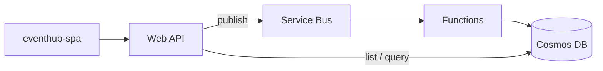

# EventHub

Local full-stack baseline: Angular SPA (`eventhub-spa`), .NET Web API (`EventHub.WebApi`), Azure Functions (`EventHub.FunctionApp`), plus Cosmos DB and Azure Service Bus emulators via Docker Compose.

## System architecture

The solution follows an **API → queue → worker → database** path for writes, and **API → database** for reads.

| Layer | Role |
|--------|------|
| **eventhub-spa** | Angular UI (dev server or container). |
| **EventHub.WebApi** | REST API: `POST /api/events` publishes an “event created” message to Service Bus; `GET /api/events` lists events from Cosmos (paged, optional `type`, `userId`, and `createdFrom` / `createdTo` filters on `CreatedAt`, UTC). |
| **EventHub.FunctionApp** | Service Bus trigger on queue `queue.1`; deserializes messages and upserts documents into the Cosmos **Events** container via shared `EventHub.Cosmos` types. |
| **EventHub.Cosmos** | `CosmosClient` registration, database/container bootstrap, `CosmosEventWriter`, and document shape (partition key path **`/Id`**, aligned with event id). |
| **Emulators (Compose)** | Linux Cosmos emulator (HTTPS gateway), Service Bus emulator (backed by Azure SQL Edge), plus optional Application Insights connection string from `.env`. |



## Trade-offs

- **Asynchronous ingestion:** The API acknowledges `POST` after enqueueing to Service Bus, not after a successful Cosmos write. That keeps the HTTP path responsive and isolates transient store failures to the worker (retries / DLQ depend on emulator and hosting config), at the cost of **eventual consistency**—a client may briefly get an empty or stale list after create.
- **Cosmos as the read model:** One container and partition key by event id favors clear document identity; **listing** uses queries that may span partitions, which is acceptable for this baseline but is a cost and latency consideration at very large scale.
- **Optional “real” backends:** If `CosmosDb:ConnectionString` or `ServiceBus:ConnectionString` is missing, the API uses **no-op** implementations so you can run or test without emulators—at the expense of empty lists or no outbound messages until configured.
- **Local emulators vs Azure:** Compose uses the **Linux Cosmos emulator (preview)** and the **Service Bus emulator** with SQL Edge; TLS to the Cosmos gateway may use **`CosmosDb:DisableServerCertificateValidation`** in development only. Behavior and limits differ from production Azure.
- **Resource footprint:** The Cosmos emulator container is memory-heavy (see `mem_limit` in `docker-compose.yml`); the full stack is aimed at developer machines, not minimal CI without adjustment.

## How to run it

### Prerequisites

- [.NET 8 SDK](https://dotnet.microsoft.com/download)
- [Node.js](https://nodejs.org/) (LTS or current; matches Angular 21)
- [Docker Desktop](https://www.docker.com/products/docker-desktop/) (with Compose)
- [Azure Functions Core Tools](https://learn.microsoft.com/azure/azure-functions/functions-run-local) (only if you run Functions on the host instead of Compose)
- EULA acceptance for the [Service Bus emulator](https://github.com/Azure/azure-service-bus-emulator-installer/blob/main/EMULATOR_EULA.txt) and SQL Edge (see Microsoft SQL Edge terms)

### Full stack (recommended)

1. Create a `.env` file in the repo root with **`SQL_PASSWORD=<strong password>`** (required by SQL Edge and the Service Bus emulator). Optionally set **`APPLICATIONINSIGHTS_CONNECTION_STRING`** for telemetry.
2. From the repo root:

```bash
docker compose up --build
```

3. Typical URLs: SPA **http://localhost:4200**, Web API **http://localhost:5080** (Swagger UI at `/swagger`), Functions **http://localhost:7071**, Cosmos Data Explorer **http://localhost:1234**, Service Bus management HTTP **http://localhost:5300**.

If **`eventhub-webapi` exits or restarts** on first `docker compose up`, the Cosmos emulator is often still starting: the API **retries** provisioning the database for up to about a minute. The image also listens on **`0.0.0.0:8080`** so published port **5080** works reliably on Docker Desktop (Windows).

After it stays up, open **http://localhost:5080/swagger** (or your API routes) to confirm it is responding.

### Run services on the host (mixed with Docker emulators)

Start only the emulators if you prefer local debugging for app code:

```bash
docker compose up cosmos-emulator servicebus-emulator sqledge
```

Then configure `CosmosDb__*` and `ServiceBus__*` (or `appsettings.Development.json`) to point at **localhost** ports; see ports below.

**Angular SPA**

```bash
cd eventhub-spa
npm install
npm start
```

**Web API**

```bash
cd EventHub.WebApi
dotnet run
```

Swagger UI is always available at **`/swagger`** on the Web API host (e.g. **http://localhost:5080/swagger** with Compose, or **http://localhost:5262/swagger** with `dotnet run`; the dev profile binds **0.0.0.0:5262** so you can open it from another machine on your LAN).

**Azure Functions**

```bash
cd EventHub.FunctionApp
func start
```

### Tests and load

- **Unit / integration:** `dotnet test EventHub.WebApi.Tests/EventHub.WebApi.Tests.csproj` — Cosmos integration tests are skipped if the emulator is not reachable.
- **k6 load tests:** See [`load-tests/README.md`](load-tests/README.md).

### Ports (host)

| Service | Port |
|---------|------|
| Angular (`ng serve`) | 4200 |
| Web API | 5080 |
| Azure Functions | 7071 |
| Cosmos emulator (HTTPS gateway) | 8081 |
| Cosmos Data Explorer | 1234 |
| Service Bus (AMQP) | 5672 |
| Service Bus (management HTTP) | 5300 |

### Cosmos DB from Web API and Functions

Compose sets `CosmosDb__ConnectionString` and `CosmosDb__DisableServerCertificateValidation` for the Linux emulator (HTTPS gateway at `https://cosmos-emulator:8081/` on the Compose network). For `dotnet run` on the host, use `EventHub.WebApi/appsettings.Development.json` (localhost) or the same environment variables.

### npm on a full system drive

If `npm install` fails with `ENOSPC` on Windows, point the cache to a drive with free space, for example:

```bash
npm config set cache "D:\npm-cache"
```

### Service Bus emulator: log warnings and `BufferQueue` / entity errors

The Service Bus emulator runs **.NET on Linux** (distroless). You may see warnings such as:

- **`PlatformNotSupportedException`** on `EventHandler.BeginInvoke` or **performance counters not supported** — the image touches Windows-only APIs in some code paths; these are **benign** for local dev.
- **`Server GC is disabled`** — Compose sets **`DOTNET_gcServer=1`** on the emulator service so the runtime prefers server GC; if a critical log line still appears once at startup, it is usually **not** fatal if AMQP and your app work.

If logs show **`Entity '...BufferQueue-1' was not found`** or SQL errors under **`SbMessageContainerDatabase`**, the emulator often started **before SQL Edge was ready** or the SQL volume is in a bad state. Try:

1. **`docker compose down -v`** (drops the SQL Edge data volume) then **`docker compose up --build`** again.
2. Ensure **`.env`** uses a strong **`SQL_PASSWORD`** and that it has **not** changed between runs while the old volume still exists (password mismatch leaves SQL or the emulator confused).

`docker-compose.yml` waits for SQL Edge **`service_healthy`** (via `sqlcmd`) before starting the Service Bus emulator to avoid that race. After `up`, you can confirm the emulator with **`GET http://localhost:5300/health`** (when exposed on the host).

---

Cosmos DB Linux emulator: see [Linux-based emulator](https://learn.microsoft.com/en-us/azure/cosmos-db/emulator-linux) for HTTPS and SDK notes (image tag may be `latest` or a documented preview).
